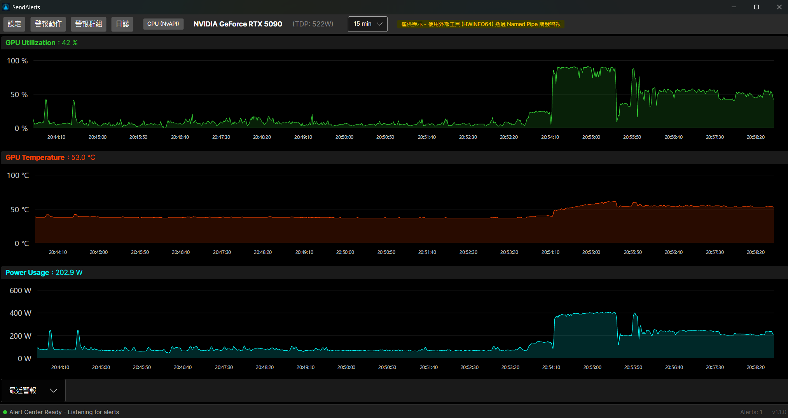
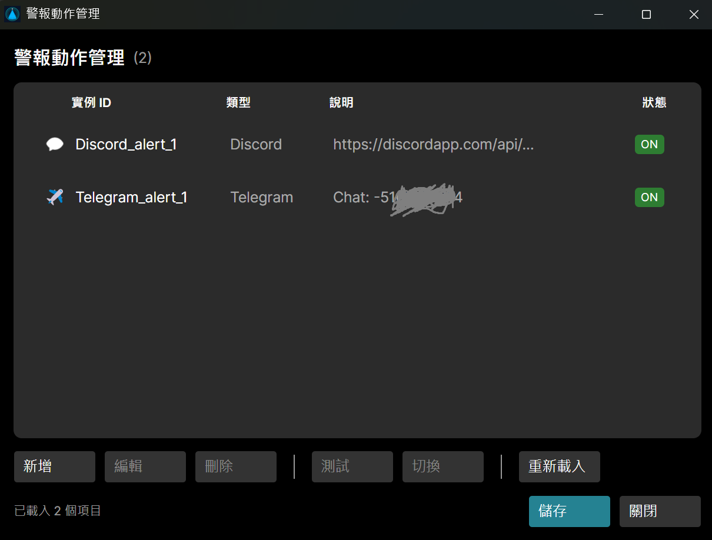
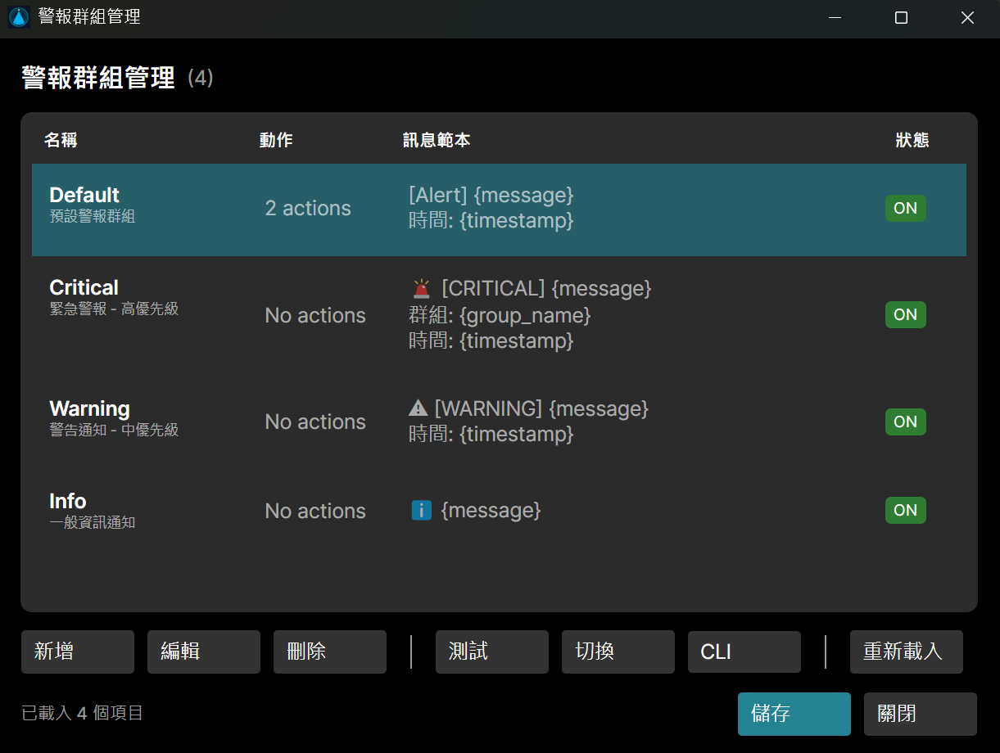
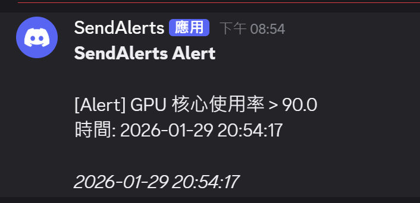
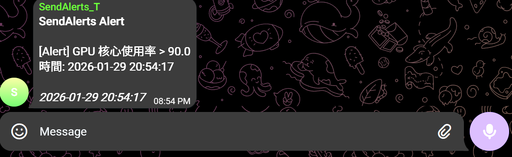

# SendAlerts

警報中繼站 (Alert Relay Station)

[](https://dotnet.microsoft.com/)
[](https://avaloniaui.net/)
[](LICENSE)

> ## ⚠️ 法律免責聲明 (Legal Disclaimer)
>
> **本軟體係依「現狀」(AS IS) 提供，開發者不負任何形式的擔保責任。**
> 使用者應了解，本工具涉及對顯卡底層硬體 (NVML) 的存取與監測。此為非必要功能，在任何情況下，開發者對於因使用或無法使用本軟體而產生的任何直接、間接、附帶、特別、懲罰性或衍生性損害（包括但不限於：硬體損壞、數據損失、系統損壞或營收損失）均不負任何賠償責任。
> **THE SOFTWARE IS PROVIDED "AS IS", WITHOUT WARRANTY OF ANY KIND, EXPRESS OR IMPLIED. IN NO EVENT SHALL THE AUTHORS BE LIABLE FOR ANY CLAIM, DAMAGES OR OTHER LIABILITY.**

---

## 簡介

SendAlerts 是一款「硬體警報中繼站」，接收來自外部工具（如 HWiNFO64）的警報觸發指令，並透過多種管道（Discord、Telegram、命令列等）一次發送通知。
原本是想要做一個簡單的 16pin 12VHPWR 顯卡電源監控警報工具，但是試了不少 NvApi，經由它的 Repos 的文件去查，再進行測試，結果就是讀不出來，那轉個念想，市面上已經有 HWiNFO 這種超強工具了，直接用它當前端就好。HWiNFO 可以發送警示，要丟 Discord 也不困難，原則上不用手頭上這個工具也行，不過到時設定會散在各個地方。結果就把這工具改成警報中繼站。
變成一些警示設定設在這，HWiNFO 負責監控硬體狀態並觸發警報。

主畫面顯示 GPU/CPU 即時監控資訊（僅供參考），**警報功能由外部工具透過 Named Pipe 或 HTTP API 觸發**。
<div style="display: flex; flex-wrap: wrap; gap: 10px;">
  
</div>

### 核心功能

- **Alert Center** - 接收 Named Pipe / HTTP API 指令，執行多管道警報
- **多管道通知** - 支援 Discord Webhook、Telegram Bot、命令列執行
- **群組管理** - 將多個 Action 組合為 Group，針對Group來發送警示，可一次觸發多個不同的通知路徑
- **即時監控顯示** - GPU/CPU 使用率、溫度、功耗即時圖表（僅顯示，沒有警報功能）
- **HTTP API** - 支援遠端機器透過 HTTP 發送警報，開啟此功能會要求一次管理員權限
- **CLI 工具** - 提供命令列工具發送警報工具，除HTTP API傳送外，警報功能皆大多是透過 CLI 使用
- **系統匣** - 最小化至系統匣背景執行
- **Watchdog** - 獨立監控程式，偵測主程式異常退出時自動重啟，OS 關機時安全停止
- **多語系** - 支援英文、繁體中文、日文介面
- **版本號自動化** - 編譯時自動產生 `vYYYYMMDD` 格式版本號

### 架構概念

```
外部工具 (HWiNFO64, 自訂腳本等)
        │
        ▼ Named Pipe / HTTP API
┌───────────────────────────────┐
│      SendAlerts Desktop       │
│  ┌─────────────────────────┐  │
│  │     Alert Center        │  │
│  │  ┌─────────────────────┐│  │
│  │  │ Group: "Critical"   ││  │
│  │  │  → Discord_Admin    ││  │
│  │  │  → Telegram_All     ││  │
│  │  └─────────────────────┘│  │
│  └─────────────────────────┘  │
└───────────────────────────────┘
```

## 安裝與執行

### 系統需求

- Windows 10/11 (Linux 需自行建置)
- .NET 10 Runtime
- (選用) NVIDIA 驅動程式 - 用於 GPU 監控顯示

### 從原始碼建置

```bash
git clone https://github.com/user/SendAlerts.git
cd SendAlerts
dotnet build
dotnet run --project SendAlerts.Desktop
```

### 執行檔位置

建置後，執行檔位於：
```
SendAlerts.Desktop/bin/Debug/net10.0/win-x64/
├── SendAlerts.Desktop.exe    # 主程式
├── SendAlerts-cli.exe        # CLI 工具
└── SendAlerts.Watchdog.exe   # Watchdog 監控程式
```

## 使用說明

### 基本設定

1. 啟動 `SendAlerts.Desktop.exe`
2. 點擊 **Alert Actions** 設定通知管道 (Discord Webhook, Telegram bot 等)。一般來說設定 Discord Webhook 是最簡單的方式。開一個伺服器頻道，建立 Webhook 後貼上 URL 即可。請注意 Action 名稱不可重複、每個 Action 有 Cooldown 時間，意思是如果同一個 Action 頻繁的收到訊息發送請求，SendAlerts 也不會受理。
<div style="display: flex; flex-wrap: wrap; gap: 10px;">
  
</div>

3. 點擊 **Alert Groups** 建立群組，選擇要包含的 Actions。Discord 和 Telegram 皆可設定多個不同的 Action、來發送至不同頻道或使用不同 Bot。群組設定中有一個 CLI 按鈕，這是用來顯示 CLI 指令列的指令範本，方便後續使用外部工具觸發警報。
<div style="display: flex; flex-wrap: wrap; gap: 10px;">
  
</div>

4. 關閉視窗後程式會縮小至系統匣背景執行

### Watchdog 監控程式

`SendAlerts.Watchdog.exe` 是獨立的監控程式，用於偵測主程式 (`SendAlerts.Desktop`) 是否在運行：

- 每 10 秒檢查主程式狀態，若主程式異常退出會自動重啟
- 主程式正常關閉時會通知 Watchdog 一併退出
- OS 關機/登出時 Watchdog 會安全停止，不會在關機過程中嘗試重啟主程式
- 透過系統匣圖示運行，右鍵可手動退出

### 觸發警報

#### 方式一：CLI 工具
```bash
SendAlerts-cli send -g Critical -m "GPU 溫度過高！"
```

#### 方式二：Named Pipe (PowerShell)
```powershell
'{"GroupName":"Critical","CustomMessage":"警報訊息"}' | Out-File -FilePath \\.\pipe\sendalerts-pipe -Encoding utf8
```

#### 方式三：HTTP API
```bash
curl -X POST http://localhost:58080/api/send \
  -H "X-API-Key: YOUR_API_KEY" \
  -H "Content-Type: application/json" \
  -d '{"groupName":"Critical","message":"警報訊息"}'
```

### HWiNFO64 整合

詳細設定請參閱 [`docs/HWiNFO-Setup.md`](docs/HWiNFO-Setup.md)

## 多語系支援

| 語系 | 代碼 | 自動偵測 |
|------|------|----------|
| English | en | 預設 |
| 繁體中文 | zh-TW | OS 語系 zh-TW, zh-Hant |
| 日本語 | ja | OS 語系 ja-* |

可在 Settings 手動切換語系。

## 技術堆疊

- **Framework**: .NET 10 / C#
- **UI**: Avalonia UI (MVVM + CommunityToolkit.Mvvm)
- **Hardware API**: NVIDIA NVML / NvAPI
- **Charts**: ScottPlot (SkiaSharp)
- **Logging**: Serilog
- **HTTP Server**: System.Net.HttpListener

## 訊息接收範例
<div style="display: flex; flex-wrap: wrap; gap: 10px;">
  
</div>

<div style="display: flex; flex-wrap: wrap; gap: 10px;">
  
</div>

## 設定檔及 log 位置

| 檔案 | 路徑 |
|------|------|
| 設定檔 | %AppData%\SendAlerts\settings.json |
| Log | %AppData%\SendAlerts\logs\SendAlerts-YYYY-MM-DD.log |
| 硬體 DB | %AppData%\SendAlerts\gpu_mapping.json |

展開後通常是 C:\Users\<使用者>\AppData\Roaming\SendAlerts\。

Linux 上對應 ~/.config/SendAlerts/。 (未開發)

## 開發文件

- 詳細規格請參閱 [`docs/Spec.md`](docs/Spec.md)
- 開發指南請參閱 [`CLAUDE.md`](CLAUDE.md)
- HWiNFO64 整合請參閱 [`docs/HWiNFO-Setup.md`](docs/HWiNFO-Setup.md)

## 授權

MIT License
